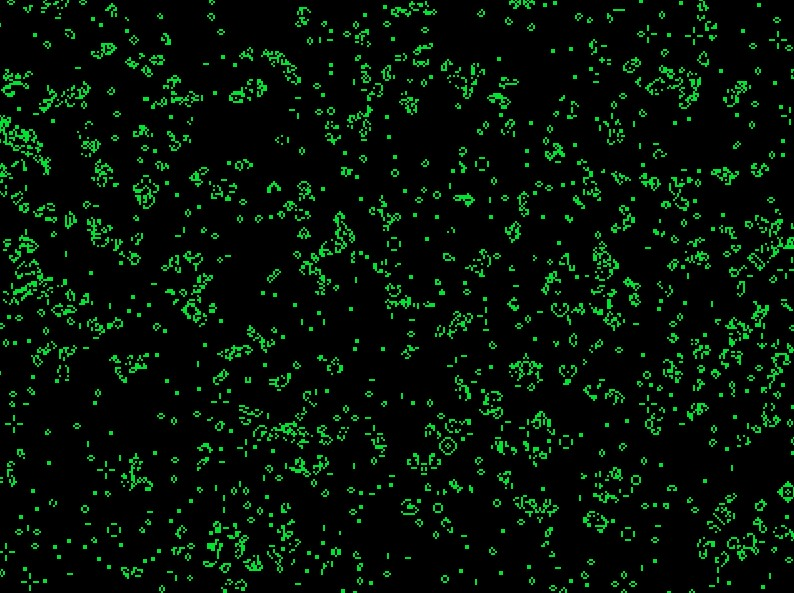

# 🕹️ Jeu de la Vie - Conway Simulation

Ce projet est une simulation du **Jeu de la Vie** de John Conway, implémentée en **C++** avec la bibliothèque **Raylib**.

## 🎮 Fonctionnalités
- Grille dynamique avec cellules vivantes/mortes
- Simulation optimisée avec un affichage rapide
- Mise à jour des cellules selon les règles classiques de Conway

## 📸 Aperçu
Voici un aperçu de la simulation en action :



## 🛠️ Installation et Compilation
### 📥 Prérequis
- **Raylib** (bibliothèque graphique)
- Un compilateur **C++** (GCC, Clang, MSVC, etc.)

### 🏗️ Compilation
Avec **g++** sous Linux/Mac :
```sh
g++ -o convay src/main.cpp -Iinclude -Llib -lraylib
